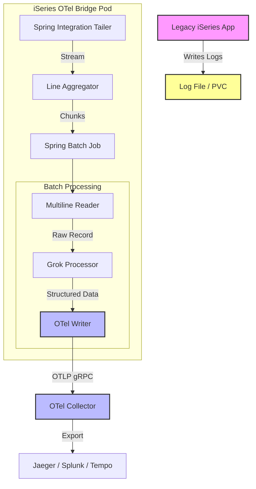

# iSeries OpenTelemetry Bridge

A production-ready Spring Batch application designed to bridge legacy iSeries (AS/400) application logs to modern OpenTelemetry (OTel) observability platforms.


## Overview

Many legacy systems (like IBM iSeries) output logs to local files in proprietary or unstructured formats. This bridge acts as a modern shipper that:

1.  **Tails** active log files in real-time.
2.  **Parses** complex log lines using **Grok** patterns.
3.  **Injects** Trace IDs and Span IDs from log content into OTel context.
4.  **Exports** structured logs to any OTLP-compliant backend (Jaeger, Grafana Tempo, Splunk, etc.).

## Architecture



### Deployment Modes

The application supports two deployment modes:

- **Single Pod Mode**: Low volume (<1K logs/sec), direct file tailing
- **Multi Pod Mode**: High volume with Kafka message queuing for horizontal scaling

See [HORIZONTAL_SCALING_DESIGN.md](HORIZONTAL_SCALING_DESIGN.md) for scaling architecture details.

## Key Features

*   **Reliability**: Persistent file tailing (handles rotation/restarts) and Spring Batch chunk processing.
*   **Multiline Support**: Automatically stitches Java stack traces or multi-line records into single OTel LogRecords.
*   **Trace Context Injection**: Extracts `trace_id` and `span_id` from logs to enable distributed tracing correlation.
*   **Metrics Extraction**: Can parse `key=value` metrics from logs and export them as structured attributes.
*   **Cloud Native**: Dockerized, stateless (state via file system), and Kubernetes-ready.
*   **Horizontal Scaling**: Supports Kafka-based distributed deployment for high-volume workloads.

## Tech Stack

*   **Language**: Java 17 (Eclipse Temurin)
*   **Framework**: Spring Boot 3.2, Spring Batch, Spring Integration
*   **Observability**: OpenTelemetry Java SDK
*   **Parsing**: Java Grok (Elasticsearch-compatible patterns)
*   **Message Queue**: Apache Kafka (for distributed mode)
*   **Build**: Maven

## Quick Start

### Prerequisites
*   Java 17+
*   Maven 3.8+
*   Docker (optional, for OTel Collector)

### Build
```bash
mvn clean package
```

### Run Locally
```bash
# 1. Start OTel Collector (Optional)
docker-compose up -d

# 2. Run the application
java -jar target/iseries-otel-bridge-1.0-SNAPSHOT.jar \
  --input.file.path.tail=/path/to/your/legacy.log \
  --otel.exporter.otlp.endpoint=http://localhost:4317
```

### Code Formatting
This project uses **Spotless** to enforce Google Java Style.
```bash
mvn spotless:apply
```

## Configuration

Configuration is handled via `application.properties` or Environment Variables (recommended for K8s).

| Env Variable | Default | Description |
|--------------|---------|-------------|
| `INPUT_FILE_PATH_TAIL` | *(empty)* | Absolute path to the log file to tail. |
| `PARSER_GROK_PATTERN` | `%{GREEDYDATA:message}` | Grok pattern to parse log lines. |
| `OTEL_EXPORTER_OTLP_ENDPOINT` | `http://localhost:4317` | OTLP gRPC endpoint. |
| `OTEL_SERVICE_NAME` | `iseries-log-bridge` | Service name in OTel backend. |

### Kafka Configuration (Distributed Mode)

| Env Variable | Default | Description |
|--------------|---------|-------------|
| `KAFKA_BOOTSTRAP_SERVERS` | `localhost:9092` | Kafka bootstrap servers. |
| `KAFKA_TOPIC` | `iseries-logs` | Kafka topic for log messages. |
| `KAFKA_CONSUMER_GROUP_ID` | `iseries-log-consumers` | Consumer group ID. |

## Deployment

### Docker
```bash
docker build -t iseries-otel-bridge .
docker run -v /var/log/app:/logs -e INPUT_FILE_PATH_TAIL=/logs/app.log iseries-otel-bridge
```

### Kubernetes
See [KUBERNETES_DEPLOYMENT_GUIDE.md](KUBERNETES_DEPLOYMENT_GUIDE.md) for detailed deployment instructions covering:
- Single pod deployment
- Multi-pod (tailer + consumer) deployment
- Horizontal Pod Autoscaling (HPA)

### AWS EKS
See [DEPLOY_EKS.md](DEPLOY_EKS.md) for detailed instructions on deploying to AWS EKS.

## Testing

The project includes a comprehensive test suite with **81% code coverage**:

```bash
# Run all tests
mvn test

# Run specific test class
mvn test -Dtest=GrokItemProcessorTest

# Run specific test method
mvn test -Dtest=GrokItemProcessorTest#testGrokParsing
```

### Test Categories
*   **Integration Tests**: End-to-end batch flow (`BatchIntegrationTest`)
*   **Unit Tests**: Grok pattern parsing (`GrokItemProcessorTest`)
*   **iSeries Format Tests**: QHST, job log, and message queue formats (`ISeriesLogFormatsTest`)
*   **Performance Tests**: 1-hour load simulation (`LargeScaleSimulationTest`)
*   **Configuration Tests**: Bean creation and configuration validation
*   **Kafka Integration Tests**: Message buffering and consumer behavior

For detailed testing instructions, see [E2E_TESTING_GUIDE.md](E2E_TESTING_GUIDE.md).

## iSeries Log Formats

The application supports various iSeries (AS/400) log formats:

| Format | Description | Pattern |
|--------|-------------|---------|
| QHST | System history log | `DATE TIME QHST MSG_NUM MSGID MSG_TYPE MESSAGE` |
| JOBLOG | Job log | `DATE TIME JOBLOG JOB_NAME MSGID TYPE SEV PROGRAM MESSAGE` |
| MSGQ | Message queue | `DATE TIME MSGQ JOB_NAME MSGID MESSAGE_TYPE MESSAGE` |

Sample test data is available in `src/test/resources/iseries_*.log`.

## Governance

This project adheres to strict architectural principles defined in the [Project Constitution](.specify/memory/constitution.md).
Key tenets: **Reliability**, **Observability First**, and **Configuration Over Code**.

---
*Maintained by the OpenCode Team*
